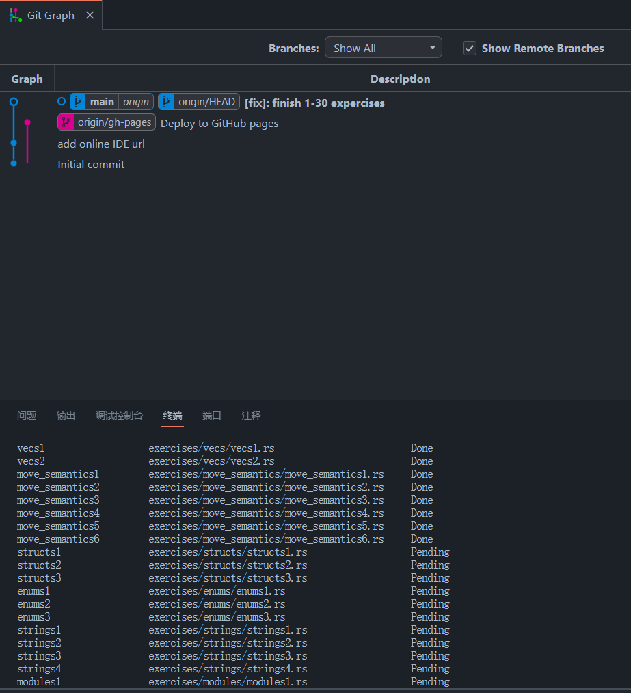
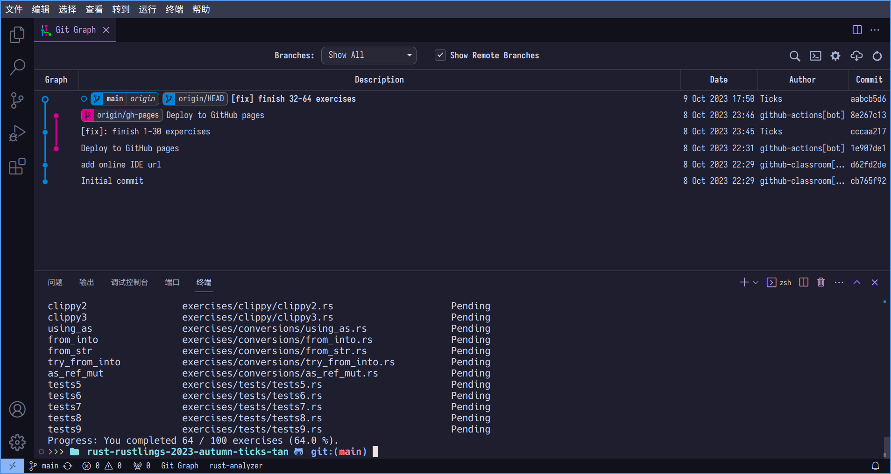

# LearningOSNote
2023秋季操作系统训练营学习记录

## [第一阶段](https://github.com/LearningOS/rust-based-os-comp2023/blob/main/2023-autumn-scheduling-1.md) 

目标： 掌握Rust编程基本知识，了解 RISC-V 体系架构及汇编指令，学习操作系统相关硬件知识。

- ### **(10/08)**

通过[Rust语言圣经](https://course.rs/about-book.html)学习了Rust的安装以及环境配置，学习了Rust语言变量命名、声明，了解了常用内置类型如i32、u32等，熟悉了基本流程控制如 if、while等，对引用、所有权、借用进行了粗略的认识，知道了借用的几大规则，并对函数定义实现等进行了了解。

rustling 提交记录：

[学习总结](docs/1-1008.md)

- ### **(10/09)**

通过 [Rust语言圣经](https://course.rs/about-book.html) 以及 [RustStd](https://doc.rust-lang.org/std/) 学习了更复杂的数据结构如 `HashMap`、`Vec` 、`String` 等，了解了非常常用的模式匹配，初步了解了Rust泛型编程包括泛型和`Trait`，对 `Option` 和 `Result` 使用有所了解，学习了包和模块的使用。

rustling 提交记录：

[学习总结](docs/1-1009.md)